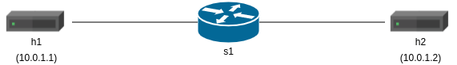

# P4 lab - Blackholing
The objective of this exercise is to write a P4 program that implements basic blackholing. After marking a port as blocked, switch will drop all traffic designated there.

# Step 1: Implement basic blackholing
The `black_hole.p4` file contains an implementation of the simplest forwarding, which switches all trafic from port 1 to port 2 and from port 2 to port 1. It also contains comments marked with TODO which indicate the functionality that you need to implement. A complete implementation of the `black_hole.p4` switch will be able to to drop traffic for a given port.




# Step 2: Run solution
1. In order to run a solution, run:
```
make run
```
2. After running the solution start HTTP server and try to fetch data from the other host. Request should complete successfully.
```
h2 python -m SimpleHTTPServer 8000 &
h1 wget 10.0.1.2:8000
```
3. Open another console, run simple_switch_CLI and connect to a switch:
```
simple_switch_CLI --thrift-port=9090
```
4. Add en entry in the blackholing table:
```
table_add blackholing blackhole_action 8000 =>
```
5. Try to fetch data from HTTP server again. It should fail.
6. Delete an entry from the table.
``` 
table_delete blackholing 0
```
7. HTTP server should operate back normally.
